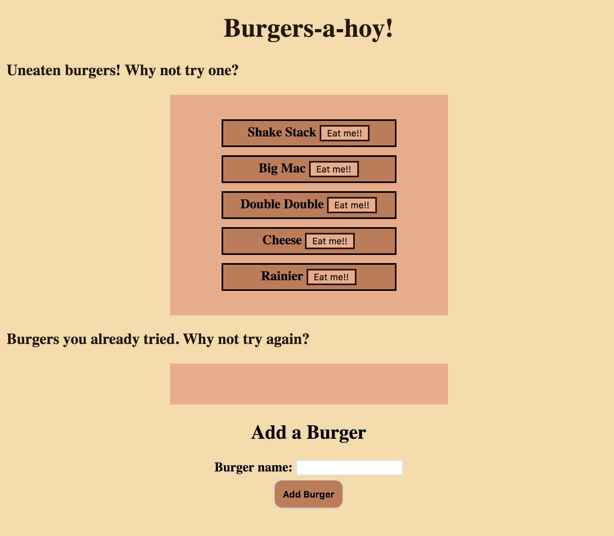

# Burger taster!

### Objective
Utilize MySQL, Node, Express, Handlebars, and a custom ORM. 
Use MVC design pattern: Use Node and MySQL to query and route data, and Handlebars to generate the HTML. 

### Overview

