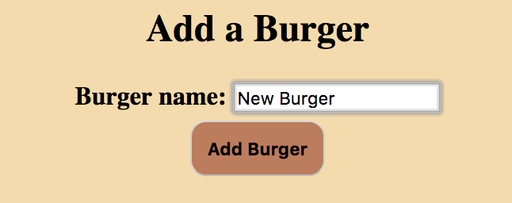
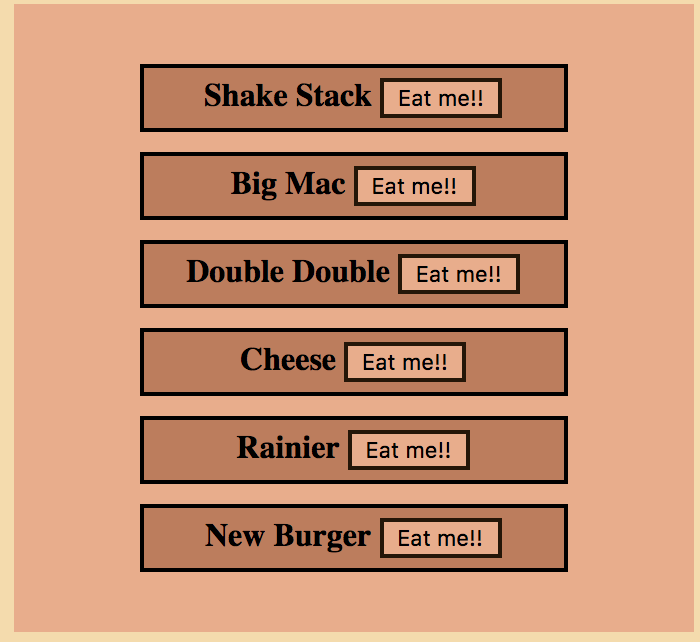
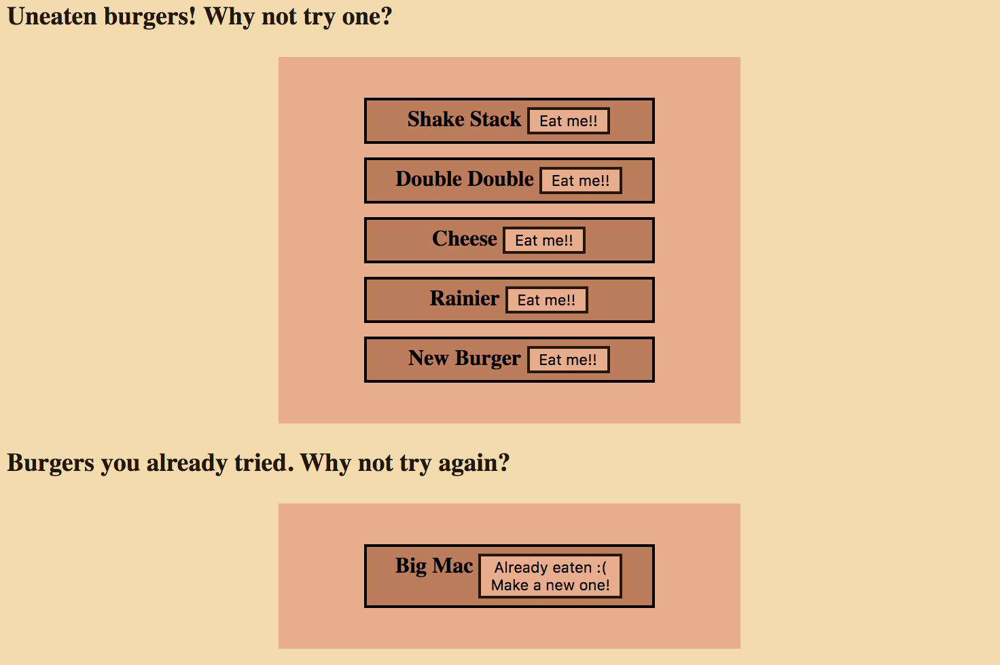

# Burger taster!

### Objective
Utilize MySQL, Node, Express, Handlebars, and a custom ORM. 
Use MVC design pattern: Use Node and MySQL to query and route data, and Handlebars to generate the HTML. 

### Overview

App begins by showing the user a menu of burger options: 

User is able to add a burger with a custom name: 

The new burger is added to the menu: 

The user is then able to "devour the burger," or if it already has been eaten, make a new one. The burger moves between two menus. 

